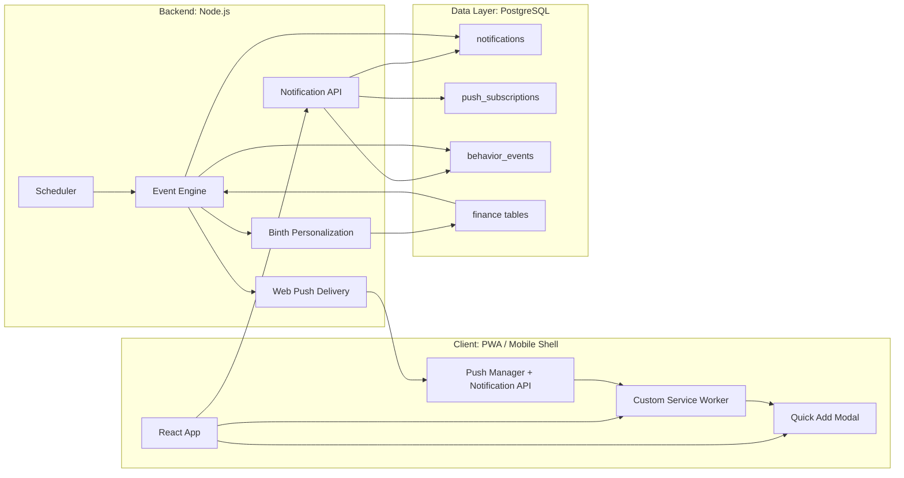

# Mwanga Intelligent Notification Engine

## Architecture



## Event Flow

1. User enables push from Settings and the client subscribes with VAPID.
2. The subscription is stored in `push_subscriptions`.
3. A transaction event or scheduler tick reaches the notification event engine.
4. The AI layer builds tone-aware copy from live financial context.
5. The backend stores the notification in `notifications`.
6. `web-push` delivers the payload to the browser service worker.
7. The service worker shows action buttons and routes clicks to `/quick-add`.
8. The React layout opens the instant quick-add modal and records the interaction.

## Behavioral Layers

- `motivation`: celebrate streaks, consistency, and savings moments.
- `reminder`: nudge users when the day or month still needs a financial check-in.
- `warning`: create healthy pressure when spending approaches or exceeds budget.

## AI Personalization Example

Input signals:

- latest transactions
- current budget pressure
- savings streak
- unread notifications
- cash vs. expense balance

Output contract:

```json
{
  "title": "Bom momentum financeiro",
  "message": "Mausse, ainda faltam os movimentos de hoje. Fecha o dia em 20 segundos e protege a tua sequencia.",
  "tone": "friendly",
  "quickActions": ["Adicionar despesa", "Adicionar receita", "Fechar o dia"]
}
```

## Data Model

### notifications

- `id`
- `household_id`
- `user_id`
- `title`
- `message`
- `type`
- `channel`
- `tone`
- `action_payload`
- `metadata`
- `dedupe_key`
- `status`
- `read`
- `sent_at`
- `delivered_at`
- `opened_at`
- `clicked_at`
- `created_at`

### push_subscriptions

- `id`
- `household_id`
- `user_id`
- `endpoint`
- `p256dh_key`
- `auth_key`
- `expiration_time`
- `device_type`
- `platform`
- `user_agent`
- `is_active`
- `failure_count`
- `last_error`
- `last_seen_at`
- `created_at`
- `updated_at`

### behavior_events

- `id`
- `user_id`
- `household_id`
- `event_name`
- `event_source`
- `event_value`
- `context`
- `created_at`

## Trigger Logic

- No transactions today at reminder time -> `reminder`
- Monthly commitments due near configured window -> `reminder`
- Budget usage at 80%+ after a spend -> `warning`
- Three-day+ logging streak -> `motivation`
- Savings transaction logged -> `motivation`

## UX Strategy

- Keep copy short, specific, and action-first.
- Use “daily closure” language to reinforce habit loops.
- Reward consistency with streak-style framing.
- Use pressure only when tied to a real budget threshold.
- Open the fastest possible task surface: the quick-add modal, not a cold page.

## Mobile / Native Path

The payload contract is shared and ready for a Capacitor or native wrapper:

- same `action_payload`
- same behavioral types
- same interaction tracking endpoint
- same backend scheduler and personalization engine

## Required Environment Variables

- `VAPID_PUBLIC_KEY`
- `VAPID_PRIVATE_KEY`
- `VAPID_SUBJECT`
- `APP_TIMEZONE` optional, defaults to `Africa/Maputo`
- `NOTIFICATION_SCHEDULER_INTERVAL_MS` optional
- `NOTIFICATION_AI_PROVIDER` optional
- existing Binth provider keys for AI copy generation
