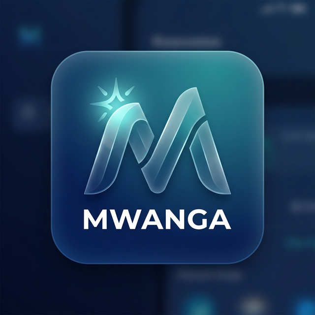

# 🌊 Mwanga ✦ — Gestão Familiar & Crescimento Patrimonial



O **Mwanga** é uma plataforma SaaS de elite para gestão financeira familiar, desenhada para transformar o controle de gastos em **Crescimento Patrimonial**. Sob o selo de qualidade **NEXO VIBE**, o Mwanga alia a sofisticação do design **Glassmorphism 2.0** à inteligência proactiva da assistente virtual **Binth**.

---

## ✨ Funcionalidades Premium

### 🤖 Binth Insights (IA Financeira)

- **Conselhos em Tempo Real**: A Binth analisa os seus dados reais (salário, poupança, excedentes) e sugere acções imediatas para optimizar o seu capital.
- **Score Financeiro Dinâmico**: Avaliação constante da sua saúde financeira com base no seu comportamento.
- **Chat Interactivo**: Tire dúvidas e peça sugestões directamente através do chat da Binth.

### 📱 PWA & Suporte Offline

- **Instalação Mobile/Desktop**: Instale o Mwanga directamente no seu dispositivo como um app nativo.
- **Funcionamento Offline**: Aceda aos seus dados essenciais mesmo sem ligação à internet, graças ao suporte de Service Workers.
- **Carregamento Ultra-rápido**: Caching inteligente de assets para uma experiência instantânea.

### 💳 Modelo de Monetização SaaS

- **Três Níveis de Prosperidade**:
  - **Starter (Free)**: Para quem está a começar a organizar a casa.
  - **Crescimento (Plus)**: Simuladores inteligentes e score avançado para profissionais urbanos.
  - **Património (Premium)**: Planeamento de reforma, BI avançado e suporte prioritário.

---

## 🚀 Tecnologias

### **Frontend**

- **React + Vite**: Performance e rapidez de carregamento.
- **Vite PWA**: Transformação em Progressive Web App com Service Workers.
- **Lucide React**: Ícones premium e consistentes.
- **Recharts**: Gráficos de fluxo de caixa e BI.
- **Vanilla CSS (Glassmorphism 2.0)**: Sistema de design proprietário com mesh gradients.

### **Backend**

- **Node.js + Express**: API de alta performance com gestão dinâmica de CORS.
- **SQLite (better-sqlite3)**: Base de dados relacional multi-tenant.
- **JWT (JSON Web Tokens)**: Segurança bancária e gestão de sessões.

---

## 🛠️ Instalação e Execução

### Pré-requisitos

- Node.js (v18 ou superior)
- NPM ou Yarn

### Passos

1. **Clone o repositório**

   ```bash
   git clone https://github.com/Jubilio/mwanga.git
   cd mwanga
   ```

2. **Instale as dependências**

   ```bash
   npm install
   cd server && npm install
   ```

3. **Configuração**
   Crie um ficheiro `.env` na pasta `server/` com:

   ```env
   JWT_SECRET=sua_chave_secreta_aqui
   PORT=10000
   ALLOWED_ORIGINS=https://seu-frontend.vercel.app,http://localhost:5173
   ```

4. **Execução**

   ```bash
   # Backend
   cd server && npm start

   # Frontend
   npm run dev
   ```

---

## 🎨 Branding: NEXO VIBE

O Mwanga faz parte do ecossistema **NEXO VIBE**, uma marca dedicada à excelência tecnológica e inovação digital liderada por Jubílio Maússe.

---

## 👨‍💻 Autor e Estrategista

Desenvolvido por **Jubílio Maússe** — *Fullstack Developer & Financial Strategist*.

---
*Mwanga ✦ 2026 — O seu legado começa aqui.*
