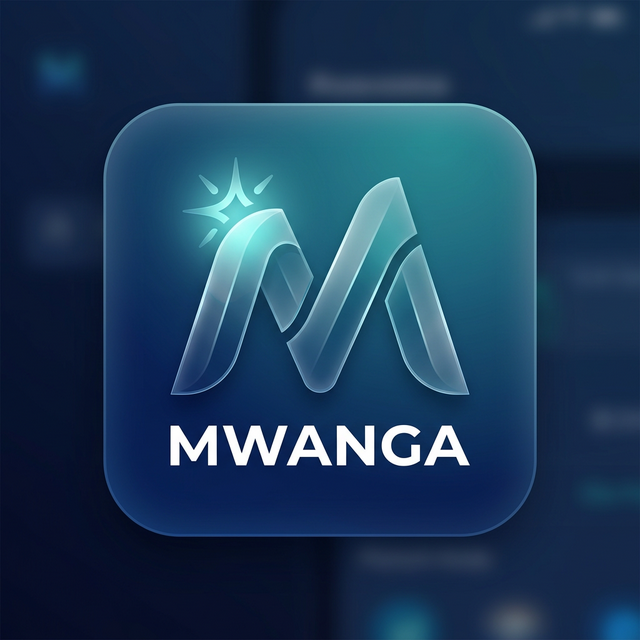

  

<h1 align="center">Mwanga</h1>

  <strong>Clareza nas finanças. Direção para o futuro.</strong> 
  Gestão financeira pessoal e familiar com identidade moçambicana.

  <a href="https://mwanga-opal.vercel.app"><strong>Conhecer o Mwanga →</strong></a>

---

## Uma visão completa da vida financeira

O **Mwanga** é um produto da **NexoVibe** que reúne receitas, despesas, orçamentos, poupanças e compromissos num único espaço. Foi concebido para ajudar pessoas e famílias a compreender o destino do seu dinheiro, organizar as prioridades e acompanhar os objetivos que querem alcançar.

Da gestão das despesas de casa ao planeamento de uma meta, o Mwanga aproxima os números das decisões do dia a dia.

## O que pode encontrar no Mwanga

| Área | Experiência |
| --- | --- |
| **Visão financeira** | Um painel para acompanhar receitas, despesas e saldo, com gráficos que ajudam a interpretar os registos. |
| **Transações e orçamento** | Organização de movimentos por categoria e acompanhamento dos limites de despesa. |
| **Metas de poupança** | Objetivos com progresso visível, para acompanhar o caminho até cada conquista. |
| **Habitação e dívidas** | Acompanhamento de rendas, compromissos e pagamentos num contexto familiar. |
| **Xitique** | Uma área dedicada à poupança comunitária, integrada na experiência financeira. |
| **Património e simulações** | Organização de ativos e passivos e exploração de cenários para apoiar o planeamento. |
| **Relatórios e inteligência** | Resumos, análises e sugestões baseadas nos dados registados. |

## Binth — inteligência que acompanha

A **Binth** é a assistente do Mwanga. Através de conversa e sugestões contextuais, ajuda a interpretar os registos, identificar categorias acima do orçamento e reconhecer prioridades de organização financeira.

As sugestões locais continuam disponíveis quando o serviço de IA não responde. As projeções são apresentadas como estimativas, e a qualidade da análise acompanha a qualidade dos dados registados.

## Feito para o quotidiano moçambicano

O Mwanga aproxima a tecnologia dos hábitos e necessidades de quem o utiliza:

- **Metical e contexto local**, com espaço para despesas familiares e práticas como o xitique.
- **Português e inglês**, com uma experiência bilingue em evolução.
- **Acesso pelo navegador**, no computador ou no telemóvel.
- **Recursos offline**, para consultar dados essenciais disponíveis no dispositivo.
- **Experiência Android em desenvolvimento**, como parte da evolução do produto.

## A marca NexoVibe

A **NexoVibe** é a marca de tecnologia por trás do Mwanga, criada por **Jubílio Maússe**. A sua proposta é transformar necessidades concretas em produtos digitais úteis, com atenção à experiência de utilização, à organização da informação e ao contexto de quem os utiliza.

No Mwanga, essa identidade traduz-se numa experiência visual cuidada e numa ideia central: tornar a gestão financeira mais compreensível e próxima das pessoas.

## Conheça a experiência

Este repositório apresenta a identidade, a proposta e a evolução do **Mwanga** como produto do ecossistema **NexoVibe**.

**[Explore o Mwanga](https://mwanga-opal.vercel.app)** e conheça uma forma de organizar o presente e planear o futuro.

---

  <strong>Mwanga · NexoVibe</strong> 
  Organizar o presente. Construir o amanhã.

